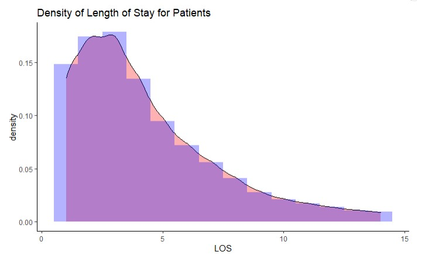
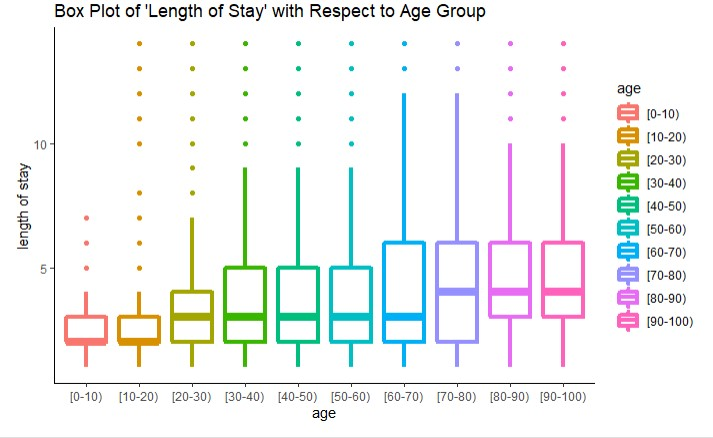
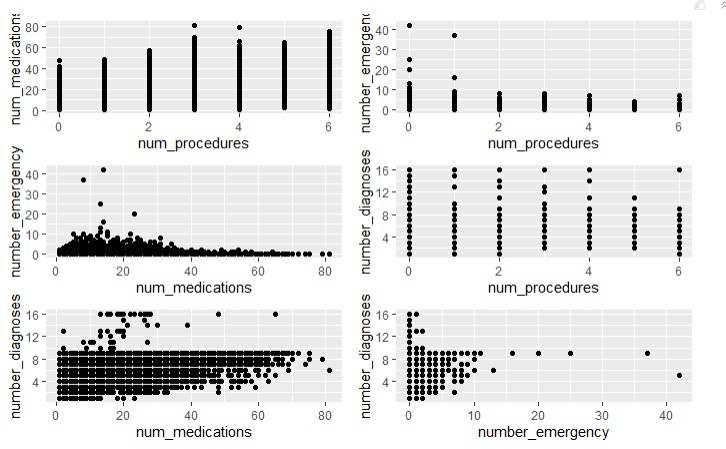
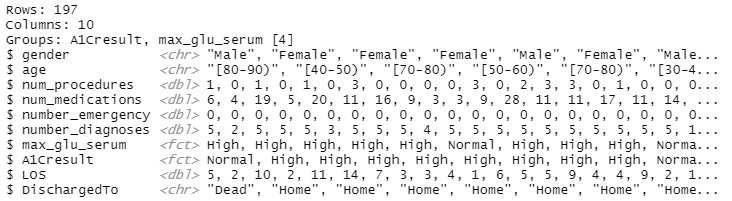

# Diabetes - Patient Outcomes and Healthcare Costs

## Task
This is an individual and independent guided tutorial so you learn the basics of manipulating datasets and doing some simple cleaning before conducting any exploratory data analysis. For this tutorial only, you may work with **one other classmate** but it is expected that by the end of the activity, each student will be able to complete the activity independently (i.e. learn the skills covered in this tutorial). If you choose to work with another classmate, you must include the full name of your partner as part of your submission.

You have all the necessary code needed to complete the task from Weeks 1-2, and you will also be introduced to some useful tools in the tidyverse package and how to use them to study the accompanying dataset. When in doubt, you are always encouraged to check the R documentation for any function or command by typing `?command_name` in the console. It is strongly recommended that you knit after any piece of code or written response, especially if you are new to R Markdown to ensure that your formatting is correct. This will make it easier for you to isolate any errors.

Questions about the tutorial should be discussed **via email**: sta248@utoronto.ca. **Do not post tutorial questions on the discussion boards** to avoid cluttering the assigned space! 

To help simplify the upload process for you on Crowdmark, include a `\newpage` line at the end of each question in the .rmd file to start the next question on a new page. When you upload your pdf on Crowdmark, you can just drag and drop each relevant page to the corresponding question box.

## Background
Diabetes is an increasingly common disease that has been linked to a number of lifestyle factors. Patients with diabetes tend to have worse medical outcomes than similar patients without diabetes, and these patients can be costly to the healthcare system. However, not all patients with diabetes present the same burden on the healthcare system. It is in our interest to identify patients who are likely to have worse outcomes so that they can be targeted for interventions to improve outcomes and reduce costs.

First, let us dive into the dataset and put the research question and the variables in context. 

## Data

1. a1_data.csv, a dataset of 58417 patients collected from several hospitals over 8 years. It contains length of stay and readmission to hospital within 30 days as surrogates for both poor health outcomes and rising cost. Clinical variables and various medication records are also available in the dataset. 

## Variables in the Dataset

Please refer to the table at the end of the document for a comprehensive list of the variables included and their descriptions in detail.  

\begin{table}[ht]
\centering
\begin{tabular}{ll}
\hline
Variable & Definition \\
\hline
patient\_nbr & Unique identifier for the patient \\
race & Racial group of the patient \\
gender & Gender of the patient \\
age & Age group in years \\
weight & Weight in kg \\
medical\_specialty & Medical specialty admitting the patient to hospital \\
num\_lab\_procedures & Number of lab procedures during the hospital stay \\
num\_procedures & Number of medical procedures during the hospital stay\\
num\_medications & Number of medications during the hospital stay\\
number\_outpatient & Number of outpatient visits the patient made in the previous year\\
number\_emergency & Number of emergency visits the patient made in the previous year \\
number\_inpatient & Number of inpatient hospital stays the patient made in the previous year \\
number\_diagnoses & Number of medical diagnoses at the time of admission\\
max\_glu\_serum & Admission blood glucose test (None:not done; Norm=normal; >200 or >300=high) \\
A1Cresult & Admission HbA1c test (None:not done; Norm=normal; >7 or >8=high)\\
MEDICATIONS & Set of all medications used during the hospital stay \\
metformin & \\
repaglinide & Coding for all specific medications during the hospital stay\\
nateglinide & \\
chlorpropamide & No = not used\\          
glimepiride & Down = decreased\\             
acetohexamide & Steady = Continued on same dose\\
glipizide & Up = dose increased\\    
glyburide & \\    
tolbutamide   & \\          
pioglitazone  & \\
rosiglitazone     & \\      
acarbose        & \\
miglitol         & \\
troglitazone  & \\
tolazamide        & \\      
examide         & \\
citoglipton         & \\    
insulin     & \\
glyburide.metformin   & \\  
glipizide.metformin   & \\
glimepiride.pioglitazone & \\
metformin.rosiglitazone & \\
metformin.pioglitazone & End of medications used during hospital stay \\
diabetesMed   & Were any diabetes medications prescribed during the hospital stay? \\
ReferredBy  & Who referred the patient to the hospital for this stay?\\
LOS         &  Length of stay for this admission in days\\      
DischargedTo  & Where was this patient discharged to at the end of the stay?\\  
readmitted   & Was the patient readmitted after this stay? (no = not within the year)\\

\hline
\end{tabular}
\end{table}


## Getting started

Now it is time to dive into the dataset. First, let's load in all the necessary packages for the tutorial.

```{r,echo=T,message=F,warning=F}
## Load all the necessary packages.
library(ggplot2)
library(tidyverse)

```

Now, let's load in the dataset. Make sure that the file al_data.csv is stored in your working directory. You can easily check your current working directory in R through `getwd()`. You can also check in the bottom right panel: 'More' -> 'Go to Working Directory' to verify that the a1_data.csv is there.

```{r, echo=T, message=F}
diabetes <- read_csv(
  file = "a1_data.csv"
)
```


Let's first try to take a glimpse of the data, which will display a transposed version (each column appears as a row) of your data, allowing you to get a `glimpse' of all column variables. Usually, tidy datasets will have individual observations per row, with the different variable measurements listed across columns. Refer to Ch. 12 of R for Data Science on [\textcolor{blue}{Tidy Data}](https://r4ds.had.co.nz/tidy-data.html).
```{r, echo=T, message=F}
glimpse(diabetes)
```

Note that by loading the data using the read_csv command, R has already made some assumptions about the variable types — this is something you should carefully check over. “dbl” stands for “double” and is used to refer to a numeric value. “chr” refers to “character,” such as a string of letters.

There should be 58417 rows and 43 columns (variables).  

Notice that the first few patients have NAs recorded for their weights! Missing data often plagues large datasets such as electronic health records (EHR) and biorepositories. The first thing we will check here is if any missing data exists.  Here is an easy way to check for the amount of missing data for each variable in the dataset. 

```{r, echo=T}
apply(diabetes, 2, function(x){sum(is.na(x))})
```
Check `?apply` to make sure you understand what each argument does and how it is used to check for the amount of missing data. You will want to use this function again in a later question.

There are over 56000 rows with missing weight and over 28000 rows with missing medical specialty! In the literature, numerous methods have been proposed to tackle the missing data problem either through imputation or through incorporating missing data in the modeling process. We will adopt the simplest approach here by assuming that missing data occurs completely at random (Missing completely at random; MCAR) and remove all rows with missing data for at least 1 variable. \textit{Note: this is just background information justifying our choice to remove patient data that has missing data for at least one variable. Working with missing data is not covered in our course!}    

### Question 1 (4 points)

Here comes your first task: Remove variables `weight` and `medical_specialty` as they are missing in >50% of the rows. You can find the column number corresponding to these variables by using `names(diabetes)`. Then, remove any row which contains any missing data in the remaining 41 variables. 

Note: For the purpose of this exercise, "None" is not considered missing for `max_glu_serum`, `A1Cresult`, and the medication variables. Using `is.na()` to check for missing data is sufficient. 

Include a `glimpse(diabetes)` as part of your output.

\textit{Hint 1: You should have 50295 rows and 41 columns after this step. }

\textit{Hint 2: You have all the basic commands needed to do this from the R recordings/materials provided in weeks 1-2. Using Google to search for alternative commands what will accomplish this is not necessary and you are encouraged to use existing commands to remove missing data here.}

\textit{Hint 3: Make use of that new `apply` function you just learned about!}
```{r}
drop<-c(5, 6)
data <- diabetes[-drop]
diabetes <- na.omit(data)
glimpse(diabetes)
```

### Question 2 (2 points)

We would also like to check whether there are multiple entries for a single patient in this dataset. It is common that the same patient was readmitted twice within the same year. The variable `patient_nbr` contains a unique identifier for each patient. Many statistical/machine learning models assume all samples to be independent and identically distributed (IID), which could be severely violated if the same patient was recorded multiple times in the dataset.  

Your second task: Determine whether there exists duplicated patient ID (patient_nbr) in this dataset. If so, please remove any patient data with duplicated IDs.

\textit{Hint: The R built-in function `unique` might be helpful here.}

```{r}
diabetes <- diabetes[!duplicated(diabetes$patient_nbr), ]
glimpse(diabetes)
```
**
No duplicates found, since the number of rows doesn't change. 

### Question 3 (3 points)

We will ignore medication data for now and select a few variables to examine for the remaining parts of the tutorial. Your original dataset `diabetes` should now contain no missing data and no duplicated patient ID. You can always click the dataset in your Environment panel to skim over your data. 

Now, you will subset the dataset by using the `select` function to subset the patient data by keeping data on: gender, age, number of procedures, medications, emergencies, diagnoses, whether they received a glucose test or HbA1c test (two tests for blood-sugar levels), and where the patient was discharged to following their hospital stay:

```{r, echo=T, eval=F}

diabetes_clean <- diabetes %>%
  select(gender, age, num_procedures,
         num_medications, number_emergency, 
         number_diagnoses, max_glu_serum, 
         A1Cresult, LOS, DischargedTo) 


```

Report the five-number summary for the `LOS` (length of stay) variable, as well as its standard deviation.

Taking into account the summary and the standard deviation calculated above, what does this information tell us about how concentrated the data is about the mean length of stay (without looking at any plots)?

```{r, echo=T, eval=F}
min(diabetes_clean[['LOS']])
max(diabetes_clean[['LOS']])
median(diabetes_clean[['LOS']])
quantile(diabetes_clean[['LOS']], 0.25)
quantile(diabetes_clean[['LOS']], 0.75)
sd(diabetes_clean[['LOS']])
```
min: 1 
max: 14 
median: 3 
first quantile: 2; third quantile: 6; STD: 2.941071 
** & \\
The data is mostly concentrated at values below 6 (more than 75% of data is below 6), and more than 50% of all data is below 3. Thus the data is generally right-skewed. 


### Question 4 (8 points)

Five-number summary gives you a glimpse at the distribution of the variable, however, plotting the full distribution is often more informative. 

(3 points) Plot both the histogram and kernel density estimation of the `LOS` variable. You should include appropriate labels in your plot. 

(5 points) Include a brief write-up answering the following: 

* Does it confirm your answer in Question 3? 
* How would you describe the shape of the variable `LOS`? 
* What are the weaknesses of using a single parameter (e.g. mean, mode) instead of the full distribution (e.g. histogram, density estimation) for a given variable?
* Without specifying the kernel, what does R use as the default?
* Why does the function plotted by `geom_density` change when we adjust the parameter `adjust`.  

This following code snippet gives the general structure for creating the plot. You will need to fill in the missing inputs, and any further modifications to the base code.

```{r, echo=T, eval=F}
# The ggplot2 package is loaded as part of the tidyverse
los_histogram <- ggplot(diabetes_clean, aes(x = LOS)) + # Tell ggplot to use LOS on the x axis
  theme_classic()+geom_density(adjust=1.7, alpha=.5, fill="#FF6666" )+geom_histogram(aes(y=..density..), alpha=0.3, 
                position="identity", binwidth = 1,fill="blue")+
  labs(title = "Density of Length of Stay for Patients")
los_histogram
```
```{r, echo=FALSE, fig.cap="Length of Stay Density", out.width = '90%'}

```
** & \\


1. It fits with answer in Q3, the data is right-skewed, with highest bar at day 3 and most higher bars distributed before day 6. 

2. The shape of graph is left-skewed.


3. Without using kernel plot or histogram plot, it would be hard to know the exact distribution of data, which require determination of shape; also predicting expected outcome of the event would be harder without knowing the distribution of probability (which tells the likelihood of every possible random variable outcome). 

4. By looking up in 'help' page of RStudio, the default is 'gaussian kernel'. 

5. Kernel's bandwidth is changing proportionally with the value of 'adjust', thus results in different outcomes of plot. 

### Question 5 (3 points)

Let's try to investigate the distribution for `LOS` (length of stay) given a patient's age group. Do older patients tend to have longer stays when admitted to hospitals? Appropriate labels should be included in your plot. What are the advantages / disadvantages of using boxplots and histograms? 

(1 point) The following code snippet might prove helpful to you. Further modifications are required.
```{r,echo=T,eval=F}
box <- ggplot(diabetes_clean, aes(x=age, y=LOS, color=age)) +
  theme_classic() +
  geom_boxplot(lwd=1.5) + labs(y="length of stay", title = 
                                 "Box Plot of 'Length of Stay' with Respect to Age Group")

box
```
```{r, echo=FALSE, out.width = '90%'}

```

(2 points) Based on the boxplots, what notable differences, if any, do you see in length of stay among the different age groups? & \\

**

1. Age group 0-10 and 10-20's box plots are extremely right-skewed, in which 25 percentile and 50 percentile collide, indicating at least 50% of patients with age between 10 and 20 leave hospital in less than 3 days. 

2. At least 75% of all patients with age between 30 and 60 leave hospital in five days, indicated by (moderate) right-skewed box plot. 

3. At least 50% of all patients among age group 80-100 have to stay in hospital for more than 3 days before they can leave, indicated by the 50% percentile line, which is only slightly below '5 days'. 

### Question 6 (3 points)

Often times we are interested in the relationship (correlation structure) between the variables. In this dataset, we hypothesized that patients with worse health conditions tend to receive more medications, more medical procedures during the hospital stay; have visited the emergency room more frequently in the previous year, and have more medical diagnoses at the time of admission. 

Try to plot a pairwise scatterplot using four relevant variables: `num_medications`, `num_procedures`, `number_emergency` and `number_diagnoses`. For reference, a pairwise scatterplot will plot the scatterplot of every pair of variables declared in a grid. In this case, with 4 variables, you should have ${_4\choose_2} = 6$ scatterplots for each pair or 12 scatterplots for inverting the axes for each pair. Rather than create each scatterplot individually, you can use either the R built-in function `pairs()` or the function `ggpairs()`. You will need to install the library `GGally` to use `ggpairs()`. Always check usage instruction for whichever functions you decide to use.

```{r, echo=T, eval=F}
library(GGally)
#names(diabetes_clean)
pair <- ggpairs(diabetes_clean, columns = c(3, 4, 5, 6))
library(gridExtra)
gg1<-getPlot(pair, 2, 1)
gg2<-getPlot(pair, 3, 1)
gg3<-getPlot(pair, 3, 2)
gg4<-getPlot(pair, 4, 1)
gg5<-getPlot(pair, 4, 2)
gg6<-getPlot(pair, 4, 3)
```

```{r, echo=T, eval=F}

grid.arrange(gg1, gg2, gg3, gg4, gg5, gg6)
```
```{r figurename, echo=FALSE, fig.cap="Scatter Plot of Selected Variables", out.width = '90%'}

```

(3 points) What can you conclude from this scatterplot? Are there any noticeable trends? Any trends that seem surprising? Please discuss and support any conclusions by referring to scatterplot features.

*Note: Take a look at the scatterplot with `num_procedures` and `number_diagnoses`. It's clearly a poor idea to use a regular scatterplot for showing their pairwise relationship. Since both variables are discrete and take on relatively few values, we cannot tell which particular "point" carries more weight (more common) in our dataset.*

*`Heat maps` and `correlograms` provide nice remedies to this problem. You do not need to make any changes to your graph. This note is just meant to draw your attention to appropriate plot choices for different data types (continuous vs discrete vs categorical, for example) and alternative plot options for your interest!* & \\
**

1. By emergency-medications scatter plot, as the number of emergency increases, number of medication is more convergent to region from 0 medications to 35 medications, while when the emergency number is low, the number of medications seem to spread a wide range from 0 to 80. 

2. By diagnosis-medications diagram, as number of diagnosis increases between 0 and 8, number of medications seem to spread into a wider range, in which increases from range of 0-20 (when there's no diagnosis) to a range of 0-70 (when diagnosis is between 8 and 9); 
however when diagnosis is greater than 9, number of medication seem to converge in range between 0-30 (probably because number of diagnosis seldom exceeds 9, reflected by the density of points in plot, which is much dense when num_diagnosis is below 9) 

3: By diagnosis-emergency diagram, the spread range of emergency seem to increase as number of diagnosis increases (reflected by 0-3 emergencies when no diagnosis to 0-10 emergencies when there are 9 diagnosis); however once diagnosis exceeds 9, emergency decreases to no more than 3; also area where diagnosis is below 9 is much denser than the other area, probably because diagnosis seldom exceeds 9. 


### Question 7 (5 points)

As medical services are often prioritized to patients carrying a greater risk of disease, patients are sometimes administered with the HbA1c (`A1Cresult`) and the blood glucose test (`max_glu_serum`) at admission.

In your final task, investigate whether individuals with abnormal HbA1c / Blood glucose test results have a higher risk of death during their hospital stay. **You will have to fill in one line of code missing in the code snippet below**. We only include patients who have been given both the HbA1c test and the blood glucose test. 

```{r,echo=T,eval=F}
library(dplyr)
diabetes_clean <- diabetes_clean[!(diabetes_clean$A1Cresult == "None" | diabetes_clean$max_glu_serum == "None"),]
  # Remove anyone without a HbA1c test or without a blood glucose test: 
  # A1Cresult == "None" or max_glu_serum == "None"
diabetes_clean <- mutate(diabetes_clean, 
                         A1Cresult = fct_collapse(A1Cresult, High=c(">7", ">8"), 
                                      Normal='Norm')) 
                  # Collapse factors >7,>8, see note below
diabetes_clean <- mutate(diabetes_clean, 
                         max_glu_serum = fct_collapse(max_glu_serum, 
                                        High=c(">200", ">300"), Normal='Norm')) 
                  # Collapse factors >200, >300, see note below

diabetes_clean <- group_by(diabetes_clean, A1Cresult, max_glu_serum)

#Takes the diabetes_clean dataframe and groups it by the indicated variables
#Operations of diabetes_clean will be done by groups

diabetes_clean %>% 
  count(DischargedTo) %>%         
  mutate(freq = n/ sum(n)) 
glimpse(diabetes_clean)
```

To help you understand the code snippet above:

* In the code snippet above, we modified an existing variable `A1Cresult` by combining ">7" and ">8" into one single factor "High" using the function fct_collapse. 
* The code snippet above can be concatenated (linked/chained) together using the pipe function, `%>%`, which improves readability of your code. 
* count() returns a table of the number of patients in 'DischargedTo' grouped by the combination of variables indicated in the group_by function
* Run `diabetes_clean %>% count(DischargedTo)` to see the output generated by count()
* The function `mutate` simply adds a new variable or modifies existing variables in your dataframe. In this instance, it will add a new column to diabetes_clean that calculates the proportion of patients being discharged to "Home", "Another hospital" or "Dead" using the counts from the count table

(1 point) Include a glimpse of your new diabetes_clean dataset.& \\
**
See R output. 
```{r, echo=FALSE, fig.cap="Glimpse of Modified Diabetes_Clean", out.width = '90%'}

```

(4 points) Discuss the relative frequencies of patients being discharged to "Another hospital", "Home", or the patient had passed away during the stay. Does it suggest any association between the involved variables? If so, describe the association.& \\
**

The discharge rate looks irrelevant towards the outcome of tests; the rate of being dispatched to home is relatively stable, around 80% with some error (no more than +/-5%) regardless of test result. This is quite similar towards rate of death and transferring into another hospital, which all stick around 10%, with error less than +/-3%, no matter what the test result is. 

If the result is counter-intuitive, think of a possible reason why this is the case. (Not graded)
**

One possible outcome is, these tests are not associated with the actual symptoms patients have. 